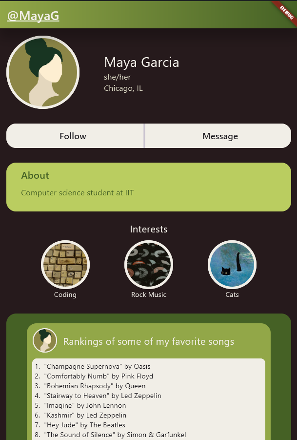

# Social Profile UI

A responsive, single-screen social profile interface built with Flutter. The project explores how reusable widgets, a small data model, and an earthy visual system can turn static profile content into a polished experience across mobile, web, and desktop layouts.



## Highlights

- Responsive profile header that adapts between compact and wide layouts
- Data-driven interests and posts rendered from reusable model objects
- Custom olive, cream, and charcoal color palette
- Circular image treatments, cards, gradients, and scrollable content
- Cross-platform Flutter targets for Android, iOS, web, Windows, macOS, and Linux
- Fictional demo content with an original abstract avatar

## Built with

- [Flutter](https://flutter.dev/) and Dart
- Material 3 theming
- Core layout widgets including `LayoutBuilder`, `Wrap`, `ListView`, and `ConstrainedBox`
- Flutter widget tests for desktop and mobile viewport behavior

## Getting started

### Prerequisites

- [Flutter SDK](https://docs.flutter.dev/get-started/install) compatible with Dart 3.2 or later
- A configured Flutter target such as Chrome, an emulator, or a desktop toolchain

### Run locally

```bash
git clone <your-repository-url> social-profile-ui
cd social-profile-ui
flutter pub get
flutter run
```

Choose a specific platform when needed:

```bash
flutter run -d chrome
flutter run -d windows
```

## Quality checks

```bash
flutter analyze
flutter test
flutter build web
```

## Project structure

```text
lib/main.dart          App entry point, models, theme, and reusable widgets
assets/images/         Profile, interest, and project preview images
test/widget_test.dart  Desktop and mobile layout checks
web/                   Web metadata and icons
android, ios, ...      Flutter platform runners
```

## Design notes

The interface deliberately keeps its content local so the project can stay focused on layout composition and visual hierarchy. Profile, interest, and post data are separated from their display widgets, making it straightforward to replace the sample content or connect a remote data source later.

## Possible next steps

- Add editable profile fields and working social actions
- Load profile content from an API or local persistence layer
- Introduce light and dark theme variants
- Expand accessibility and golden-test coverage
